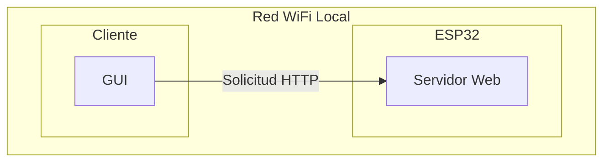
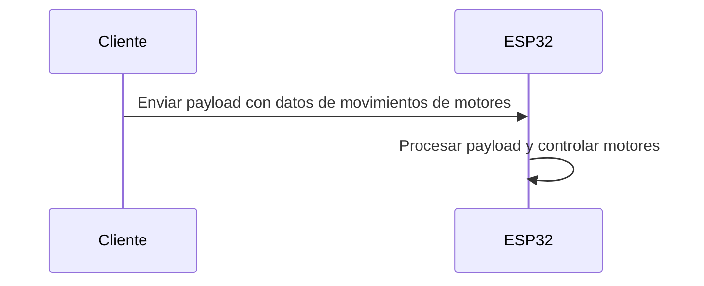

# **Delta-Robot**
This repository have the differents algorithms made in the thesis "Diseño e implementación de un robot delta de 3 grados de libertad", like the grafic user interface made in python to control the delta robot in the university EIA, and the logic in the embedded system (ESP32) [Repositorio Esp32](https://github.com/JhonierNegrete10/Delta-Robot-Esp32)

## **Table of contents**
- [Requirements](#Requirements) 
- [Step by step](#Step-by-step)
- [Features](#Features)
- [Diagrams](#Diagrams)
- [Future works](#Future-works)
- [Authors](#Authors)

### **Requirements** 
This code was made in a virtual enviroment with python 3.9.10 with the next package. 
- numpy
- requests
- tkinter 
- math 

### **Step by step**
1. First, create the virtual enviroment
    
        $ python -m venv venv

2. Enter to the virtual enviroment, in cmd terminal. 

        $ cd venv 
        $ cd scripts 
        $ activate.bat 

3. Install the Requirements

        $ pip install -r requirements.txt

4. You need to connect to the web server in the Esp32.

5. Configure the home position. 
Move the end efector to point (0,0,0) in the space. Next on the robot delta. [will be added a image or video with the home position]

[comment]: <"optional tittle"> 

## Features 
- You add the points in the workspace to those who you want move the robot delta. 
- The backend code of the GUI use inverse cinematic to calcule the angular values of the motors. 
- The code send the angular values to the Esp32 via wi-fi. 
- If the point dont exist in the workspace the interface show a messagebox saying it. 
- You can change the microstteping of the motors, this is useful for smoother movements. 
- You can send at most 4 points at the time by requests petition.
- The embedded system use the AcellStepper library to calcule the trayectory point to point. 
- You can reconfigure the dimensions, the aceleration and the speed values in the config button. 

[comment]: <## Best Practices>

## Diagrams
### Comunication Diagram 

### Sequence Comunication Diagram 

## Future works 

## Authors 
- [me](https://github.com/JhonierNegrete10/)
- Alejandro López, thesis partner 